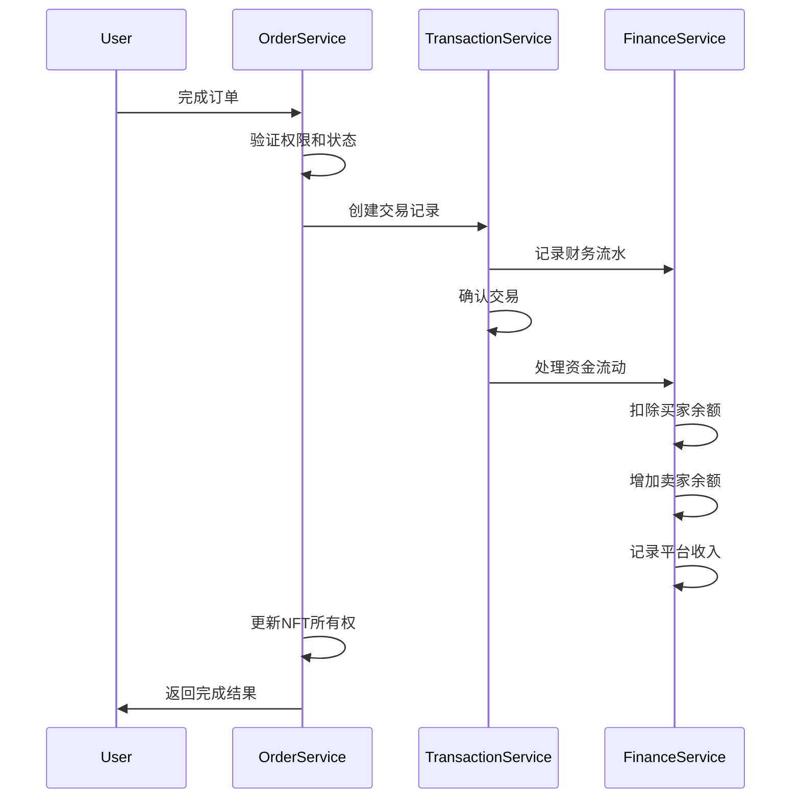

# 交易模块和财务模块实现说明

## 模块关系架构

```
订单(Order) → 交易(Transaction) → 财务(Finance)
     ↓              ↓                ↓
  用户意向      →    实际交易     →    资金流动
```

## 核心实体关系

### 1. 交易实体 (Transaction)

- **作用**: 记录所有实际完成的交易
- **关联**:
  - 关联订单 (Order)
  - 关联NFT (ValueID)
  - 关联买家和卖家 (User)
- **字段**:
  - 交易哈希、类型、状态
  - 交易金额、手续费、净金额
  - 支付地址、币种
  - 区块链相关信息

### 2. 钱包实体 (Wallet)

- **作用**: 管理用户的多个钱包地址和余额
- **特点**:
  - 支持多币种
  - 支持多种钱包类型 (MetaMask, WalletConnect等)
  - 自动创建内部默认钱包

### 3. 财务记录实体 (FinancialRecord)

- **作用**: 记录所有资金流动
- **类型**: 收入、支出、手续费、佣金、退款、提现、充值
- **分类**: 交易、租赁、平台手续费、Gas费、版税等

## 业务流程

### 1. 订单完成流程



### 2. 财务处理流程

**买家侧**:

1. 扣除交易金额
2. 记录支出流水
3. 更新钱包余额

**卖家侧**:

1. 增加净收入 (扣除手续费)
2. 记录收入流水
3. 更新钱包余额

**平台侧**:

1. 收取手续费
2. 记录平台收入
3. 统计平台收益

## 核心功能实现

### 1. 交易服务 (TransactionsService)

#### 核心方法:

- `create()` - 创建交易记录
- `confirmTransaction()` - 确认交易
- `failTransaction()` - 标记交易失败
- `getUserTransactionStats()` - 获取用户交易统计

#### 特性:

- 自动生成内部交易ID
- 集成财务流水记录
- 支持交易状态管理
- 提供详细的交易查询

### 2. 财务服务 (FinanceService)

#### 钱包管理:

- `createWallet()` - 创建钱包
- `getUserWallets()` - 获取用户钱包列表
- `getUserBalance()` - 查询用户余额

#### 余额管理:

- `addBalance()` - 增加余额
- `deductBalance()` - 扣除余额
- `transfer()` - 用户间转账

#### 提现充值:

- `withdraw()` - 提现功能
- `deposit()` - 充值功能

#### 财务记录:

- `recordTransaction()` - 记录交易流水
- `getFinancialRecords()` - 查询财务记录
- `getUserFinancialStats()` - 获取财务统计

## API 接口说明

### 交易接口 (/api/v1/transactions)

```typescript
// 获取用户交易记录
GET /transactions
Query: {
  type?: 'purchase' | 'sale' | 'rental',
  status?: 'pending' | 'completed' | 'failed',
  page?: number,
  limit?: number
}

// 获取交易统计
GET /transactions/stats

// 确认交易
POST /transactions/:id/confirm

// 标记交易失败
POST /transactions/:id/fail
```

### 财务接口 (/api/v1/finance)

```typescript
// 钱包管理
POST /finance/wallets          // 创建钱包
GET /finance/wallets           // 获取钱包列表
GET /finance/balance/:currency // 查询余额

// 转账功能
POST /finance/transfer         // 用户间转账

// 提现充值
POST /finance/withdraw         // 提现
POST /finance/deposit          // 充值

// 财务记录
GET /finance/records           // 财务记录查询
GET /finance/stats             // 财务统计
```

## 数据库设计

### 交易表 (transactions)

```sql
- id: 主键
- transactionHash: 交易哈希
- type: 交易类型 (purchase/sale/rental)
- status: 交易状态 (pending/completed/failed)
- amount: 交易金额
- fee: 平台手续费
- netAmount: 净金额
- currency: 支付币种
- fromAddress/toAddress: 支付地址
- valueIdId: NFT ID
- buyerId/sellerId: 买家/卖家ID
- orderId: 关联订单ID
```

### 钱包表 (wallets)

```sql
- id: 主键
- userId: 用户ID
- address: 钱包地址
- currency: 币种
- balance: 余额
- frozenBalance: 冻结余额
- type: 钱包类型
- status: 钱包状态
- isDefault: 是否默认钱包
```

### 财务记录表 (financial_records)

```sql
- id: 主键
- userId: 用户ID
- type: 记录类型 (income/expense/fee等)
- category: 分类 (trading/rental/platform_fee等)
- amount: 金额
- currency: 币种
- balanceBefore/balanceAfter: 变更前后余额
- description: 描述
- transactionId: 关联交易ID
```

## 安全考虑

### 1. 权限控制

- 只有订单相关用户可以操作
- 卖家确认完成订单
- 钱包所有者管理钱包

### 2. 数据一致性

- 使用数据库事务确保原子性
- 余额变更记录完整流水
- 交易状态严格管理

### 3. 错误处理

- 余额不足检查
- 交易状态验证
- 异常回滚机制

## 手续费机制

### 平台手续费

- 默认费率: 2.5%
- 从交易金额中扣除
- 买家支付总额，卖家收到净额
- 平台收取手续费作为收入

### 费用计算示例

```
交易金额: 100 ETH
手续费率: 2.5%
手续费: 2.5 ETH
卖家净收入: 97.5 ETH
平台收入: 2.5 ETH
```

## 扩展功能

### 1. 区块链集成

- 支持真实的区块链交易
- 自动验证链上交易
- Gas费管理

### 2. 多币种支持

- 支持多种加密货币
- 汇率转换
- 跨链交易

### 3. 高级财务功能

- 分期付款
- 自动分润
- 收益分享
- 税务报告

## 监控和统计

### 1. 交易监控

- 实时交易状态
- 异常交易预警
- 交易成功率统计

### 2. 财务统计

- 平台总收入
- 用户交易活跃度
- 资金流动分析

### 3. 用户财务报告

- 个人交易历史
- 收支明细
- 投资收益分析

---

这个实现提供了完整的交易和财务管理功能，支持NFT交易平台的核心业务需求，并为未来的功能扩展留下了空间。
